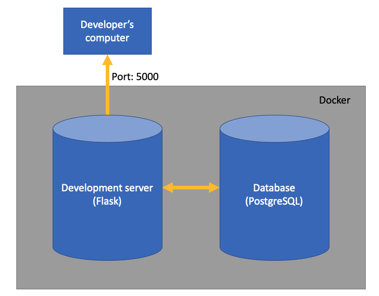

# Development

## Instructions for development

- Start development server: `docker-compose up`
  - Start development server after editing files related Docker, database_structure.sql or pyproject.toml: `docker-compose up --build`
  - Start development server without outputting logs (as detached): `docker-compose up -d`
  - View container output from detached container _(`app` = dev-server, `db` = database, both can be given in format `app db`)_: `docker-compose logs -f app`
- Stop development server: `docker-compose down`
- If development server is up, server can be shut down with key combination `CTRL + C`
- Stop development server and remove database's volume: `docker-compose down -v`
- Build development container (and not starting server): `docker-compose build`
- Reset development server: `docker-compose down -v && docker-compose build && docker-compose up`
- Run Robot tests in container: `docker-compose --profile test up`
- Run unit tests in container against test database: `docker-compose -f docker-compose.test.yml up --abort-on-container-exit && docker-compose -f docker-compose.test.yml down -v`

- Running Poetry commands: `docker-compose run --no-deps --rm app poetry ...`

  - For example add Flask to dependencies: `docker-compose run --no-deps --rm app poetry add flask`
  - Running commands in Poetry's virtual environment (HOX! Don't add `--no-deps` or database is not initialized for pytest usage): `docker-compose run --rm app poetry run pytest src`

- Accessing database inside the container for gaining access to PostgreSQL CLI when running the database container: `docker exec -it lukuvinkkikirjasto-db psql --user user --password lukuvinkkikirjasto`.
  - After entering the command, it should ask for password - that is same as in the .env-file (in example `password`). Attributes for user (`user`) and database (`lukuvinkkikirjasto`) are same as in the .env-file.
  - PostgreSQL CLI can be closed with command `exit;`

Development server is accessed via `http://localhost:5000`. If that is not responding, IP Address for development server container is also achievable from logs (marked as red):


Development server is set to development mode, so it will give more information about errors and will work in hot reload -mode. So if everything should work as intended, it will be possible to edit code normally in local folder and when development server is running and changes to files should be mirrored into container.

## Example of **.env**-file

.env-file is needed for application to be functional at all. Create that into root folder in the beginning of the development.

```
POSTGRES_USER=user
POSTGRES_DB=lukuvinkkikirjasto
POSTGRES_PASSWORD=password
POSTGRES_HOSTNAME=lukuvinkkikirjasto-db
POSTGRES_PORT=5432

MODE=dev
SECRET=example
DATABASE_URI=postgresql://${POSTGRES_USER}:${POSTGRES_PASSWORD}@${POSTGRES_HOSTNAME}:${POSTGRES_PORT}/${POSTGRES_DB}
```

First section of .env-file is related to defining envinromentals for Postgres-container only during development. `POSTGRES_HOSTNAME` and `POSTGRES_PORT` is used only by development server and is not needed for production. `POSTGRES_HOSTNAME` needs to point into hostname of database's container, in this case `lukuvinkkikirjasto-db`.

Second section of .env-file is related to defining environmentals for app-container itself. These environmentals needs to be also in production by methods provided in Heroku.

## Structure of development environment



The diagram shows dependencies inside the development environment. Development server and database are isolated in Docker containers and those are linked to each other with same network inside the Docker environment.

Only port exposed outside the Docker environment is port 5000 for accessing Flask development server.

## Interacting with the database

PostgreSQL CLI can be accessed with `docker exec -it lukuvinkkikirjasto-db psql --user user --password lukuvinkkikirjasto`.

- After entering the command, it should ask for password - that is same as in the .env-file (in example `password`). Attributes for user (`user`) and database (`lukuvinkkikirjasto`) are same as in the .env-file.
- PostgreSQL CLI can be closed with command `exit;`

File named as `database_structure.sql` is injected into database container and can be used to initialize database with normal SQL commands. Content of the file will be runned in database container, when first time creating the container or the database's volume is removed with `docker-compose down -v` and then running again with `docker-compose up --build`.
